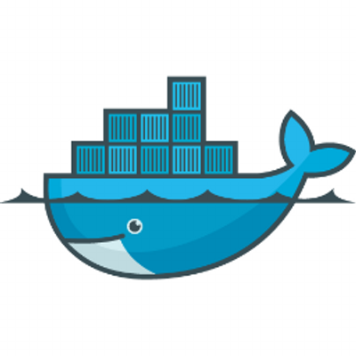

# Dockerfile for mariadb

Package provides the dockerfile which setup and run the mariadb on centos VM with configuration overwrite and database setup

 

# Features

* The docker image is built from centos/systemd 
* Allow user to create a database in the mariadb if the database is not created when docker container is started
* Allow user to configure the password for the 'root' account of mariadb
* Allow user to user to ssh into the container to start or stop the mariadb if needed
* Allow user to configure the mariadb such as default encoding, maximum connections, max packat allowed

# Usage

Git clone the project to your local computer:

```bash
git clone https://github.com/chen0040/dockerfile-centos-mariadb.git
```

## Build the mariadb docker image

Run the following command from the root folder of the project to build your own docker image:

```bash
docker build -t xschen/mariadb .
```

You can optionally save the image by running the following command:

```bash
docker save -o xschen-mariadb.img xschen/mariadb
```

## Create and start the docker container

```bash
docker run -it --name=xschen-mariadb -u 0  -d -p 3306:3306 xschen/mariadb
```

Now you should be able to connect to the mariadb from your local computer at the port 3306, 
 
an example of the data source url will be:

<pre>
jdbc:mysql://127.0.0.1:3306/my_database?useSSL=false&useUnicode=yes&characterEncoding=UTF-8
</pre>

Note that 127.0.0.1 may need to be replaced with the ip of your docker machine VM (depends how you set up your docker machine)

## Start and stop the mariadb in the container

To start or stop the mariadb in the container, make sure that the container is running, then run the following command from your local computer:

```bash
docker exec -it xschen-mariadb /bin/bash
```

Once in the container, run the following command to start or stop the mariadb:

```bash
$ cd /home/xschen
$ sudo ./start.sh
```

```bash
$ cd /home/xschen
$ sudo ./stop.sh
```


